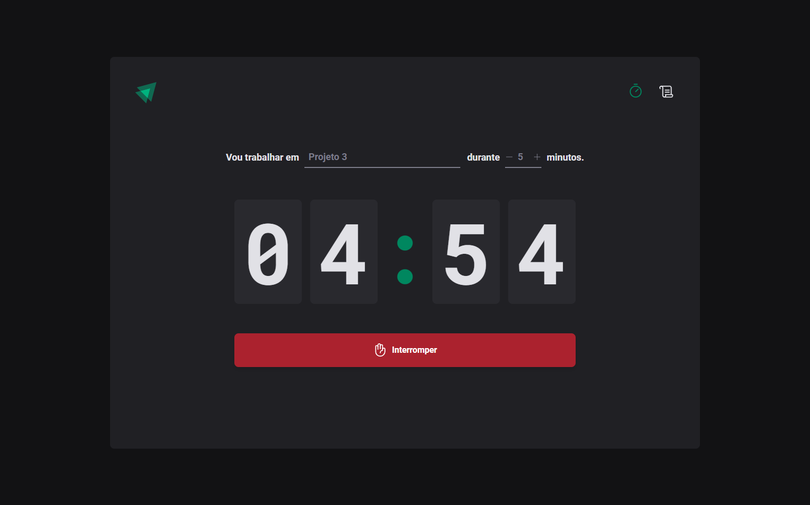
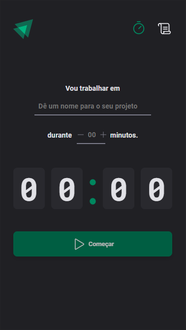
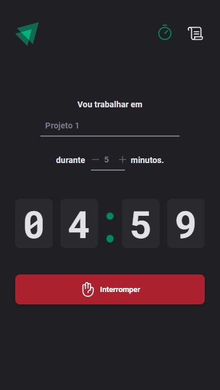

# Rocketseat - Ignite Timer

- Projeto desenvolvido na trilha de ReactJS do Ignite da Rocketseat.

## Versão desktop:

### Home page

### History page

## Versão mobile:

### Home page

  
  

### History page

  
  

